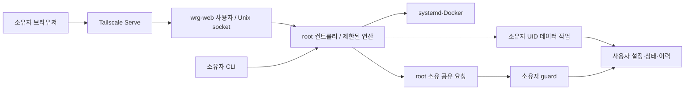

# 구조와 권한 경계

웹은 Unix listener와 Tailscale 로그인 allowlist를 확인하고 변경 요청에 Origin·CSRF를 검증합니다.
컨트롤러 소켓은 SO_PEERCRED로 root·등록 소유자·웹 UID만 허용합니다.
웹은 임의 명령·경로·유닛 내용을 전달할 수 없습니다. 기존 서비스 발견 결과를 등록하고 정해진 연산만 실행합니다.

사용자 경로는 root 프로세스에서 직접 열지 않고 고정 연산을 가진 소유자 작업 프로세스가 읽습니다.
작업 프로세스는 보조 그룹 없이 소유자 UID·기본 GID로 실행되며 파일·출력 크기와 실행 시간을 제한합니다.
사용자 데이터는 해당 계정 자체가 접근할 수 있어야 합니다. 원시 알림 비밀값은 웹 응답에 포함하지 않습니다.

개발 체크아웃은 하나이며 아래 경로는 설치기가 관리하는 실행 사본입니다. 별도의 `-public` 개발 경로는 필요하지 않습니다.
CLI/guard는 사용자 `.local/lib/wsl-resource-guard`, 웹/컨트롤러는 `/opt/wsl-resource-guard`에 설치됩니다.
서로 다른 사본의 커밋과 dirty 여부는 설치 스탬프로 비교합니다. unknown은 정상 일치로 판단하지 않습니다.

guard가 사용자 state/history를 기록합니다. 중복 guard와 `once`는 동일 상태 디렉터리 잠금을 공유합니다.
컨트롤러의 등록 정보·감사 이력과 설정 변경 요청은 root 소유 경로에 별도로 저장합니다.
자동 실행 설정과 현재 active 상태는 독립이며, 등록 삭제가 앱 프로그램·DB 삭제를 의미하지 않습니다.

PSI에는 숫자 또는 null과 수집 상태가 있습니다. 집계 시 부분 관측을 표시하며,
경보 판단의 연속 시간에 관측 실패 시간을 포함하지 않습니다. 과거 데이터는 형식을 유지해 읽습니다.

의존성 선언과 잠금은 `pyproject.toml`·`uv.lock`으로 통합합니다. 웹 가상환경은 최종 경로에서 준비·검증한 뒤
유닛이 참조하도록 전환하며, guard/컨트롤러는 기존 시스템 Python 실행 구조를 유지합니다.
사용자/시스템 설치는 owner 잠금 안에서 충돌을 검사하고, daemon은 상태 디렉터리별 실행 잠금을 추가로 잡습니다.

프로세스 종료는 snapshot의 PID·시작 시각·UID·보호 분류와 현재 대상을 비교하고 pidfd 신호를 사용합니다.
root 컨트롤러의 실제 신호 전달도 소유자 UID·기본 GID·빈 보조 그룹으로 제한합니다.
푸시 키 생성과 구독 등록/해제는 공통 잠금 안에서 처리하며, 잘못된 구독 하나가 다른 구독의 발송을 막지 않습니다.
