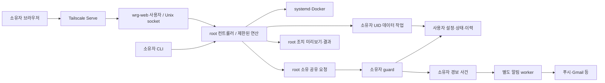

# 구조와 권한 경계

웹은 Unix listener와 Tailscale 로그인 allowlist를 확인하고 변경 요청에 Origin·CSRF를 검증합니다.
컨트롤러 소켓은 SO_PEERCRED로 root·등록 소유자·웹 UID만 허용합니다.
웹은 임의 명령·경로·유닛 내용을 전달할 수 없습니다. 기존 서비스 발견 결과를 등록하고 정해진 연산만 실행합니다.

사용자 경로는 root 프로세스에서 직접 열지 않고 고정 연산을 가진 소유자 작업 프로세스가 읽습니다.
작업 프로세스는 보조 그룹 없이 소유자 UID·기본 GID로 실행되며 파일·출력 크기와 실행 시간을 제한합니다.
사용자 데이터는 해당 계정 자체가 접근할 수 있어야 합니다. 원시 알림 비밀값은 웹 응답에 포함하지 않습니다.

개발 체크아웃은 하나이며 아래 경로는 설치기가 관리하는 실행 사본입니다. 별도의 `-public` 개발 경로는 필요하지 않습니다.
CLI/guard는 사용자 `.local/lib/wsl-resource-guard`, 웹/컨트롤러는 `/opt/wsl-resource-guard`에 설치됩니다.
서로 다른 사본의 커밋과 dirty 여부는 설치 스탬프로 비교합니다. unknown은 정상 일치로 판단하지 않습니다.

guard가 사용자 state/history를 기록합니다. 중복 guard와 `once`는 동일 상태 디렉터리 잠금을 공유합니다.
컨트롤러의 등록 정보·감사 이력과 설정 변경 요청은 root 소유 경로에 별도로 저장합니다.
자동 실행 설정과 현재 active 상태는 독립이며, 등록 삭제가 앱 프로그램·DB 삭제를 의미하지 않습니다.

PSI에는 숫자 또는 null과 수집 상태가 있습니다. 집계 시 부분 관측을 표시하며,
경보 판단의 연속 시간에 관측 실패 시간을 포함하지 않습니다. 과거 데이터는 형식을 유지해 읽습니다.

의존성 선언과 잠금은 `pyproject.toml`·`uv.lock`으로 통합합니다. 웹 가상환경은 최종 경로에서 준비·검증한 뒤
유닛이 참조하도록 전환하며, guard/컨트롤러는 기존 시스템 Python 실행 구조를 유지합니다.
사용자/시스템 설치는 owner 잠금 안에서 충돌을 검사하고, daemon은 상태 디렉터리별 실행 잠금을 추가로 잡습니다.

프로세스 종료는 snapshot의 PID·시작 시각·UID·보호 분류와 현재 대상을 비교하고 pidfd 신호를 사용합니다.
root 컨트롤러의 실제 신호 전달도 소유자 UID·기본 GID·빈 보조 그룹으로 제한합니다.
푸시 키 생성과 구독 등록/해제는 공통 잠금 안에서 처리하며, 잘못된 구독 하나가 다른 구독의 발송을 막지 않습니다.

## 사건·신원·조치

`identity.py`는 boot ID·UID·PID·시작 토큰을 묶어 프로세스 신원을 만듭니다. native argv를 보존해 공백 경로나 설정 옵션 뒤의 Codex app-server도 구분합니다. 원시 argv는 웹/알림에 내보내지 않습니다. 작업 제목은 소유자 worker가 읽은 명시적 ID와 로컬 색인이 일치할 때만 연결하며 cwd 기반 추정은 하지 않습니다.

`incidents.py`는 원인·대상별 사건 ID, revision, 관측 근거와 회복 상태를 관리합니다. 소유자 상태의 `incidents.json`은 최대 256건·약 3 MiB로 제한하며 생략을 표시합니다. 사건별 대응은 root 공유 `incident-decisions.json`에 별도로 기록합니다. 최신 관측을 잃으면 정상으로 해제하지 않습니다.

`delivery.py`의 단일 worker가 사건·채널·수신처별 전송 상태를 `delivery.json`에 기록합니다. 전송 시도를 먼저 저장하고, 재시작 후 중단된 시도는 접수 미확인으로 처리합니다. 명확한 실패는 제한된 재시도를 사용하며 timeout처럼 결과가 불명확한 전송은 즉시 자동 반복하지 않습니다. 정기 메일·주간 보고도 수집 루프와 분리합니다. `state.json`은 수집기만 쓰고 웹/CLI는 전달 요약을 읽기 전용으로 합칩니다.

`actions.py`의 root 소유 `actions.json`은 짧은 미리보기와 조치 기록을 저장합니다. 확인된 전체 프로세스 신원·구성의 fingerprint와 사용자를 대조한 뒤, 첫 신호 전에 실행 상태를 영속화합니다. 동일 ID로 실행을 반복하지 않으며 원래 자식의 잔존을 root 종료와 별도로 확인합니다. 미리보기 120초, 기록 최대 128건이며 새 미리보기 생성 시 만료된 미사용 미리보기와 1일 이전 기록을 정리합니다. 임의 셸·경로·신호 번호는 API가 받지 않습니다.

새 API는 `/api/incidents`, `/api/targets/<id>`, `/api/actions/preview`, `/api/actions/<id>/execute`, `/api/actions/<id>`입니다. 쓰기에는 기존 Origin·CSRF·Tailscale 경계가 적용됩니다. 구형 웹의 PID 단독/일괄 종료 요청은 409로 거부하므로 업데이트 후 화면을 새로 여세요. CLI 종료에도 공용 실행기·서비스 보호가 적용됩니다.

서비스 워커는 같은 사건의 revision·관측 시각만 최대 256건 저장합니다. 웹 페이지·대화 제목·알림 본문은 캐시하지 않습니다. 알림 링크는 허용된 사건 ID로 같은 origin 안에서 만들며 다른 탭의 미완료 입력을 강제로 이동시키지 않습니다.
